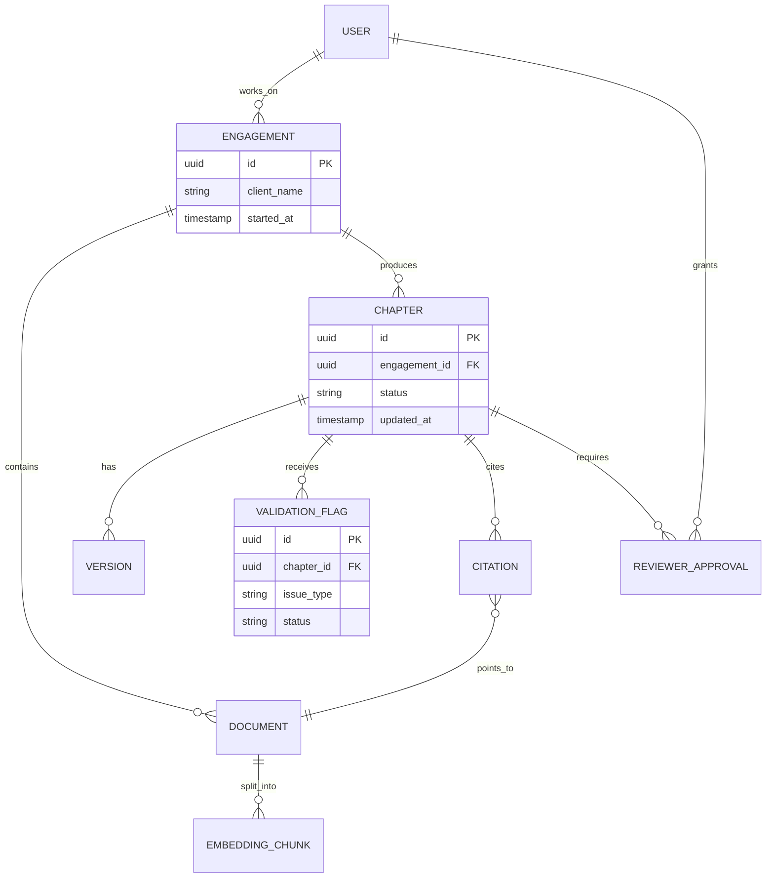

# Data model and entity relationship diagram

GitHub renders Mermaid natively inside markdown files, so the entity relationship diagram lives here as Mermaid rather than as a static image.

## Key entities

| Entity | Purpose |
|---|---|
| User | A consultant, SME, or reviewer, scoped to one or more engagements |
| Engagement | A single client project, the unit of data isolation |
| Document | An ingested source file, scoped to one engagement |
| Embedding chunk | A vector-embedded slice of a document |
| Chapter | A section of the report, generated and versioned independently |
| Version | A snapshot of a chapter at a point in time |
| Validation flag | An issue raised by the AI validation agent against a chapter |
| Citation | A link from a chapter to a specific source document |
| Reviewer approval | A logged sign-off required before a chapter can be finalized |

## Diagram

