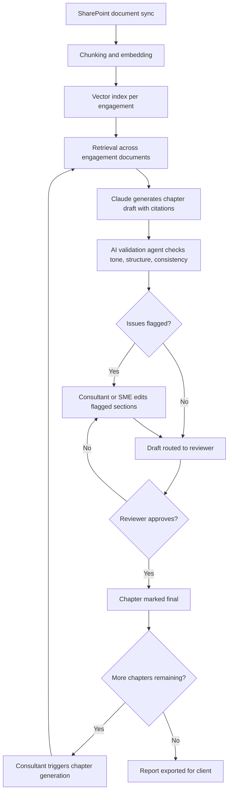
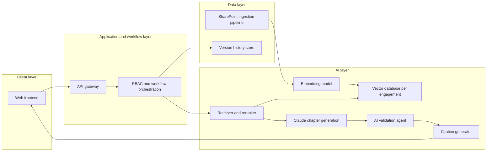
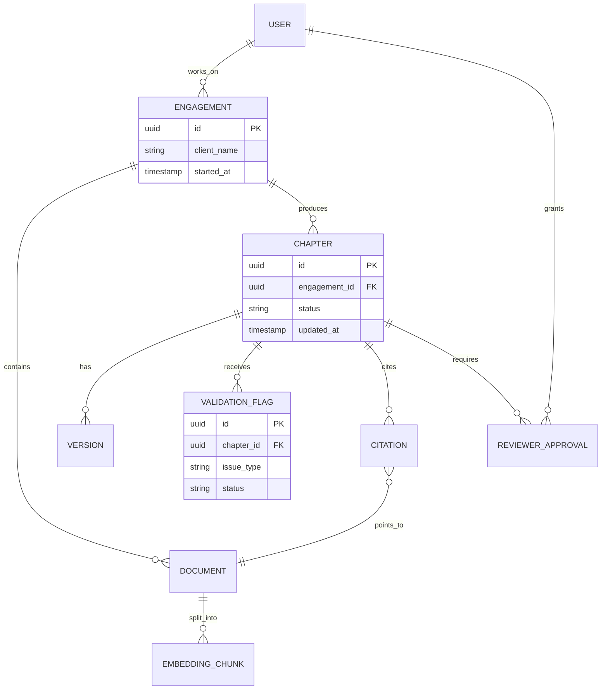

# Product Requirements Document
## AI-Powered CPD Report Builder
**Client Segment:** Environmental Consulting / Professional Services

| Field | Detail |
|---|---|
| Product Owner | AI Project Manager / Associate Product Manager |
| Document Status | Final (Portfolio Reconstruction) |
| Version | 1.0 |
| Target Platform | Web (desktop-first) |
| Deployment | Amazon Web Services (AWS) |
| Primary Client | Environmental consulting firm (anonymized) |

> **Note on methodology:** This PRD is reconstructed from delivered project documentation and written as if authored before the build kicked off. Where the source material did not specify a detail, an explicit **Assumption** is called out.

---

## 1. Executive Summary

### Product Overview
The AI-Powered CPD Report Builder is a greenfield RAG platform that automates knowledge retrieval and AI-assisted drafting for Continuing Professional Development reports. It ingests 500 to 600 enterprise documents from SharePoint, generates citation-grounded chapter drafts using Anthropic Claude, and routes every draft through an AI validation agent and human reviewer before publication.

### Problem Statement
Consultants spent 2 to 4 months producing a first-draft CPD report by manually reviewing hundreds of project documents and writing content from scratch, which fragmented knowledge across repositories, produced inconsistent report quality, and left delivery timelines dependent on senior subject matter expert availability.

### Vision
Turn months of manual document review and drafting into days, without lowering the bar on report quality or removing the human expert from the final decision.

### Value Proposition
- **For consultants:** a first-draft report in days instead of months, grounded in the firm's own project documents with citations attached.
- **For the firm:** standardized report structure and tone across engagements, and less senior SME time spent on first-draft validation.
- **For clients receiving the reports:** faster turnaround without a drop in consistency or rigor, since every AI-generated chapter passes a validation agent and a human reviewer before release.

---

## 2. Background

### Industry Context
Environmental consulting firms produce recurring compliance and CPD reports that draw on large, unstructured project archives. Report quality depends heavily on a small pool of senior consultants who can synthesize technical findings into client-ready narrative, which makes report production a bottleneck on firm capacity rather than a scalable service line.

### Existing Workflow (Pre-Product)
- Consultants manually reviewed hundreds of project documents per report, cross-referencing data by hand.
- First drafts depended on senior SME availability for both content generation and validation.
- No standardized structure existed across reports, so quality varied by author.

### Current Pain Points
| Pain Point | Impact |
|---|---|
| Manual document review across hundreds of files | 2 to 4 months to produce a first draft |
| Heavy SME dependency | Bottleneck on the firm's most senior, least available staff |
| Inconsistent report structure and tone | Extra review cycles, uneven client experience |
| Limited collaboration tooling | Slow handoffs between drafting, review, and approval |

### Why This Product Is Needed
A generic document assistant cannot maintain the citation discipline or structural consistency a professional services deliverable requires. The firm needed a platform that generates a genuinely usable first draft, grounded in its own historical reports and project documents, while keeping a human reviewer as the final authority on anything that goes to a client.

---

## 3. Users & Personas

### Primary Persona 1: Consultant (Report Author)
- **Goals:** produce a client-ready first draft quickly without sacrificing technical accuracy.
- **Pain points:** spends weeks manually searching project archives before writing a single paragraph.
- **Needs:** a chapter-by-chapter draft grounded in the right source documents, that they can edit rather than write from scratch.
- **Success criteria:** first draft ready for review in days, not months.

### Primary Persona 2: Subject Matter Expert (Reviewer)
- **Goals:** validate technical accuracy without re-reading the entire source archive themselves.
- **Pain points:** currently the bottleneck for both drafting and validation.
- **Needs:** citation-linked drafts that make it fast to check a claim against its source.
- **Success criteria:** review time per chapter drops without a drop in confidence in the output.

### Primary Persona 3: Client Stakeholder
- **Goals:** receive a consistent, accurate CPD report on a predictable timeline.
- **Pain points:** unpredictable delivery timelines tied to SME availability.
- **Needs:** faster turnaround with no perceptible drop in quality.
- **Success criteria:** reports arrive in days, and read consistently across engagements.

### Secondary Persona 4: IT / DevOps Administrator
- **Goals:** keep SharePoint ingestion and AWS infrastructure reliable at scale.
- **Pain points:** large document uploads causing ingestion timeouts.
- **Needs:** clear failure diagnostics and configurable ingestion limits.
- **Success criteria:** ingestion succeeds reliably up to the platform's supported file size and page count.

### Secondary Persona 5: Product Leadership
- **Goals:** track delivery predictability and adoption across engagements.
- **Pain points:** no visibility into where AI-assisted drafting is actually saving time.
- **Needs:** a lightweight view of report turnaround time and validation agent flag rates.
- **Success criteria:** can point to a measurable turnaround improvement across engagements.

---

## 4. Problem Statement

**Business problem:** Report production scaled with senior SME availability rather than with client demand, which capped how many engagements the firm could take on at once.

**User problem:** Consultants could not produce a first draft without months of manual document review, and reviewers could not validate a draft quickly without re-reading the same archive.

**Opportunity:** Combine RAG-based drafting with a validation agent and human-in-the-loop approval, so the platform speeds up the slowest part of the workflow (first-draft creation) without removing human judgment from the parts that require it.

---

## 5. Product Goals

| Goal | Target | Rationale |
|---|---|---|
| Compress first-draft turnaround | From 2 to 4 months down to 3 to 5 days | Core efficiency driver |
| Scale document ingestion | Support up to 300MB per file (from a 100MB starting limit) | Removes a hard technical ceiling on report scope |
| Standardize report quality | Reduce chapter-level tone and structure inconsistency via the validation agent | Protects client-facing quality at speed |
| Maintain citation integrity | Every generated chapter traceable to its source documents | Non-negotiable for a professional services deliverable |
| Scale team throughput | Support delivery across a 15-member cross-functional team without bottlenecking on SMEs | Removes the SME availability constraint |
| Client satisfaction | Maintain or improve client satisfaction despite faster turnaround *(Assumption: no baseline client satisfaction score specified in source)* | Confirms speed didn't cost quality |

---

## 6. Success Metrics

### Business Metrics
- First-draft turnaround time (target: 3 to 5 days)
- Number of concurrent engagements the firm can support
- SME hours spent per report on drafting versus validation

### Product Metrics
- Chapters generated per engagement
- Reviewer edit rate per AI-generated chapter (proxy for draft quality)
- Time from ingestion to first full draft
- Adoption of AI-assisted editing versus manual authoring

### AI Metrics
- Citation accuracy (percent of citations that correctly map to source passages)
- Validation agent flag rate (percent of chapters flagged for tone, structure, or consistency issues)
- Retrieval precision across the 500 to 600 document corpus
- Prompt benchmark score against Claude-generated gold-standard sections

### Operational Metrics
- Document ingestion success rate
- Ingestion throughput at the 300MB file size threshold
- SharePoint sync reliability
- Version history and reviewer workflow completion rate

---

## 7. User Stories

**US-01**
As a consultant, I want an AI-generated first draft of each report chapter, so that I start from an edit rather than a blank page.
*Acceptance Criteria:* Given an engagement with ingested source documents, the system generates a chapter draft with inline citations within a defined turnaround window; given insufficient source material, it flags the chapter as needing manual input rather than generating unsupported content.

**US-02**
As a subject matter expert, I want every AI claim linked to its source document, so that I can validate accuracy without re-reading the full archive.
*Acceptance Criteria:* Each generated paragraph carries at least one citation, and clicking it opens the source passage.

**US-03**
As a consultant, I want to upload large, multi-format project archives without ingestion failing, so that I don't have to manually split files.
*Acceptance Criteria:* Files up to 300MB across PDF, DOC, DOCX, XLSX, CSV, PPT, PNG, and JPEG ingest successfully; failures return a clear, specific error rather than a silent timeout.

**US-04**
As a reviewer, I want the AI validation agent to flag tone, structure, or consistency issues automatically, so that I can focus my review time on genuine judgment calls.
*Acceptance Criteria:* Flagged chapters are visually marked with the specific issue type before human review begins.

**US-05**
As a consultant, I want to edit AI-generated content directly in the platform with version history, so that I don't lose track of what changed between drafts.
*Acceptance Criteria:* Every edit is versioned, attributable to a user, and reversible.

**US-06**
As a reviewer, I want a formal approval step before a report is considered final, so that no AI-generated content reaches a client without human sign-off.
*Acceptance Criteria:* A report cannot move to "final" status without an explicit reviewer approval action logged against a named user.

**US-07**
As a product leader, I want visibility into chapter generation and validation flag rates, so that I can tell whether the platform is actually saving SME time.
*Acceptance Criteria:* A reporting view shows chapters generated, flag rate, and average review time per engagement.

**US-08**
As an IT administrator, I want clear diagnostics when a document fails to ingest, so that I can resolve the issue without escalating to engineering.
*Acceptance Criteria:* Failed ingestion returns a specific reason (file size, unsupported format, corrupted file) rather than a generic error.

---

## 8. Functional Requirements

### Authentication
- Enterprise login with role-based access. *(Assumption: specific identity provider not named in source.)*

### Knowledge Retrieval (RAG)
- Retrieval across 500 to 600 ingested enterprise documents per engagement.
- Citation-grounded generation, with a defined fallback when source material is insufficient.

### Document Ingestion
- SharePoint-based automated, multi-format ingestion (PDF, DOC, DOCX, XLSX, CSV, PPT, PNG, JPEG).
- Configurable file size ceiling, scaled from 100MB to 300MB.

### Chapter-Wise Report Generation
- AI-generated draft per chapter, grounded in retrieved context, targeting client-ready length (approximately 125 pages per full report).

### AI-Assisted Editing
- In-platform editing of AI-generated content with inline citation preservation.

### AI Validation Agent
- Automated chapter-level check for tone, structural, and consistency issues before human review.

### Version History & Reviewer Workflows
- Full version history per chapter and per report.
- Formal reviewer approval gate before a report can be marked final.

### Human-in-the-Loop Approval
- No AI-generated content reaches "final" status without an explicit human approval action.

### Collaboration
- Multi-user editing with attribution, so consultants and reviewers can work on the same report without overwriting each other's changes.

### Admin Dashboard
- Ingestion monitoring, document management, and user/role administration.

---

## 9. Non-Functional Requirements

| Category | Requirement |
|---|---|
| Performance | Chapter generation completes within a defined turnaround target; UI interactions under 200ms |
| Security | Enterprise RBAC, encryption in transit and at rest, authentication controls |
| Scalability | Support 500 to 600 documents per engagement, with a 300MB per-file ceiling |
| Reliability | Ingestion failures return specific, actionable errors rather than silent timeouts |
| Availability | Business-hours uptime target appropriate for a professional services workflow *(Assumption: exact SLA not specified in source)* |
| Compliance | Enterprise RBAC and audit trail sufficient for a professional services engagement record |
| Accessibility | WCAG 2.1 AA compliance for the web interface *(Assumption: not specified in source, included as enterprise best practice)* |

---

## 10. User Journey

1. **Ingestion:** Project documents sync automatically from SharePoint into the platform.
2. **Chapter Generation:** The consultant triggers chapter-wise draft generation, grounded in the ingested archive.
3. **Review:** The AI validation agent flags tone, structure, or consistency issues before the SME reviews the draft.
4. **Editing:** The consultant or SME edits directly in the platform, with every change versioned.
5. **Approval:** A named reviewer formally approves the chapter or report before it can be marked final.
6. **Delivery:** The finalized report is exported for the client.

---

## 11. Product Flow

---

## 12. AI Architecture

- **LLM:** Anthropic Claude, selected for strong long-form generation and citation discipline.
- **Embedding model:** paired embedding model for consistent retrieval across the ingested corpus. *(Assumption: specific embedding model not named in source.)*
- **Vector database:** enterprise document embeddings stored per engagement, isolating one client's archive from another.
- **Retrieval:** semantic search across the 500 to 600 document corpus, scoped to the active engagement.
- **Reranking:** a lightweight reranking pass over top candidates before assembling the generation context. *(Assumption: not explicitly detailed in source, included as RAG best practice.)*
- **Prompt engineering:** prompt benchmarking against Claude-generated gold-standard report sections, used to refine chapter-generation prompts.
- **Guardrails:** the AI validation agent acts as a structured guardrail, flagging tone, structure, and consistency issues rather than silently publishing them.
- **Citation generation:** every generated paragraph is required to map back to a specific source passage.
- **Response generation:** chapter drafts are generated section by section rather than as a single pass, to keep each section groundable and reviewable independently.

---

## 13. API Requirements

| Method | Endpoint | Purpose |
|---|---|---|
| POST | `/api/v1/auth/login` | Authenticate user |
| GET | `/api/v1/engagements` | List engagements the user has access to |
| POST | `/api/v1/engagements/{id}/documents/sync` | Trigger SharePoint document sync for an engagement |
| GET | `/api/v1/engagements/{id}/documents` | List ingested documents and status |
| POST | `/api/v1/engagements/{id}/chapters/generate` | Generate a chapter draft grounded in the engagement corpus |
| GET | `/api/v1/chapters/{id}` | Retrieve a chapter draft, including citations |
| PUT | `/api/v1/chapters/{id}` | Save an edit to a chapter, creating a new version |
| GET | `/api/v1/chapters/{id}/versions` | Retrieve version history for a chapter |
| POST | `/api/v1/chapters/{id}/validate` | Run the AI validation agent against a chapter |
| POST | `/api/v1/chapters/{id}/approve` | Record reviewer approval for a chapter |
| GET | `/api/v1/reports/{id}/export` | Export a finalized report |
| GET | `/api/v1/admin/ingestion-status` | Retrieve ingestion monitoring data (admin only) |

---

## 14. Data Model

**Key entities:** Users, Engagements, Documents, Embedding Chunks, Chapters, Versions, Validation Flags, Reviewer Approvals, Comments.

---

## 15. Edge Cases

- Engagement with insufficient source documents to generate a chapter, correctly flagged rather than fabricated.
- Document exceeding the 300MB ingestion ceiling, rejected with a specific size-limit error.
- Corrupted or password-protected file uploaded, rejected with a clear diagnostic rather than a silent failure.
- Two users editing the same chapter simultaneously, resolved through version conflict handling rather than silent overwrite.
- Chapter approved by a reviewer, then a dependent source document is later removed from the engagement.
- SharePoint sync interrupted mid-transfer, requiring resumable or clearly failed ingestion rather than a partial, silently incomplete index.
- Validation agent flags a chapter that a human reviewer disagrees with, requiring an override path with a logged justification.
- Duplicate document uploaded across two sync cycles, deduplicated rather than double-indexed.

---

## 16. Risks

**Technical risks**
- Vector index drift as project documents are added or revised mid-engagement.
- Ingestion pipeline instability at the upper end of the file size ceiling.

**Business risks**
- Client perception risk if faster turnaround is seen as lower rigor, despite the validation and approval gates.
- Overreliance on AI-generated drafts eroding the SME review habit over time.

**AI risks**
- Citation mapping errors that misattribute a claim to the wrong source document.
- Inconsistent tone across chapters if the validation agent's thresholds are miscalibrated.

**Operational risks**
- Delayed reviewer approvals become a new bottleneck once drafting speeds up.
- SharePoint permission mismatches blocking ingestion for a subset of project documents.

---

## 17. Prioritization (MoSCoW)

**Must Have**
- RAG-based chapter generation with citations
- SharePoint multi-format ingestion up to 300MB
- AI validation agent
- Human-in-the-loop reviewer approval
- Version history

**Should Have**
- AI-assisted in-platform editing
- Prompt benchmarking against gold-standard sections
- Admin ingestion monitoring dashboard

**Could Have**
- Multi-engagement comparative analytics
- Client-facing status portal
- Automated report formatting templates

**Won't Have (this phase)**
- Fully autonomous report publication without human approval
- External, client-facing self-service drafting
- Real-time multi-user co-editing within the same paragraph

---

## 18. Roadmap

**Phase 1 (MVP)**
SharePoint ingestion, core RAG chapter generation, and basic citation grounding, validated against a single engagement.

**Phase 2**
AI validation agent, version history, and reviewer approval workflow.

**Phase 3**
AI-assisted editing, prompt benchmarking loop, and the admin ingestion monitoring dashboard.

**Future Vision**
Multi-engagement analytics, automated formatting templates, and expanded ingestion limits beyond 300MB.

---

## 19. Engineering Considerations

**Dependencies**
- SharePoint API access and sync permissions per engagement
- AWS infrastructure provisioning

**Assumptions**
- The firm's SharePoint structure can be mapped cleanly to individual engagements for document isolation.
- Claude's context window and citation behavior are sufficient for chapter-length generation without excessive chunking overhead.

**Constraints**
- Documents must remain isolated per engagement to prevent cross-client data mixing.
- No report may reach "final" status without a logged human approval.

**Open Questions**
- What is the re-ingestion cadence when a project document is revised mid-engagement?
- What is the formal data retention policy for completed engagements?

---

## 20. Product Decisions

**RAG grounded per engagement, not a shared knowledge base**
- *Why it exists:* keeps one client's documents fully isolated from another's, which is essential in a consulting context.
- *Alternatives considered:* a single shared vector index across all engagements.
- *Trade-offs:* loses any cross-engagement pattern reuse, but eliminates cross-client data mixing risk entirely.
- *Why chosen:* the isolation guarantee was worth more than the potential efficiency of shared retrieval.

**AI validation agent as a required gate, not an optional check**
- *Why it exists:* early AI-generated chapters varied in tone and structure enough to need a standardized check before human review.
- *Alternatives considered:* relying entirely on human reviewers to catch inconsistency.
- *Trade-offs:* adds a processing step to every chapter.
- *Why chosen:* it lets human reviewers spend their time on judgment calls instead of catching mechanical inconsistencies.

**Chapter-by-chapter generation instead of a single full-report pass**
- *Why it exists:* keeps each section's citations groundable and independently reviewable.
- *Alternatives considered:* generating the entire ~125-page report in one pass.
- *Trade-offs:* requires more orchestration to stitch chapters into a coherent final report.
- *Why chosen:* a single massive generation pass makes citation accuracy and review much harder to verify.

---

## 21. Interview Talking Points

**1. Why isolate the vector index per engagement instead of one shared knowledge base?**
Client confidentiality. A shared index risks one client's project details surfacing in another's report, which is not an acceptable trade for any efficiency gain.

**2. How did you validate that AI-generated chapters were actually good enough to save time?**
Prompt benchmarking against Claude-generated gold-standard report sections, plus tracking the validation agent's flag rate and reviewer edit rate as ongoing quality signals.

**3. What was the hardest technical bottleneck, and how did you find it?**
Ingestion timeouts at roughly 100MB or 1,000 pages. I ran structured threshold testing to isolate the exact failure point before asking engineering to scale it.

**4. Why not let the AI publish directly once the validation agent passes it?**
A client-facing report is a professional liability document. Removing the human approval gate would have been a client-trust risk far larger than any turnaround gain.

**5. How do you keep report quality consistent across 15 team members and multiple engagements?**
The validation agent enforces a mechanical consistency floor, and prompt benchmarking against a shared gold-standard set keeps generation quality aligned across engagements.

**6. What would you change if you rebuilt this today?**
Build the re-ingestion cadence for mid-engagement document revisions into the MVP, rather than treating it as an open question discovered after launch.

**7. How did you scope the MVP?**
Ingestion and core chapter generation first, validated against one engagement, before layering in the validation agent, version history, and editing tools.

**8. How do you handle a reviewer disagreeing with a validation agent flag?**
An override path exists, but it requires a logged justification, so disagreements are visible rather than silently bypassed.

**9. What signal told you the platform was actually saving SME time, not just consultant time?**
Tracking SME hours spent on drafting versus validation specifically, since the goal was shifting SME effort away from first-draft writing.

**10. How does this platform's governance model differ from a banking RAG platform you've built?**
Here, isolation is per-engagement rather than per-region, and the core guardrail is a validation agent enforcing report standards rather than an access-control layer enforcing jurisdictional boundaries.

---

## 22. Portfolio Version (Case Study)

### Problem
Consultants spent 2 to 4 months producing a first-draft CPD report by manually reviewing hundreds of project documents, with quality and timeline entirely dependent on senior SME availability.

### My Role
Project Manager / Associate Product Manager owning end-to-end delivery across a 15-member cross-functional team (development, AI/ML, QA, BA, DevOps, UI/UX), through 2-week Agile sprints, with 6 client stakeholders.

### Research
Testing showed AI-generated chapters varied unacceptably in tone and structure without a standardization layer, and that large document ingestion failed at a hard 100MB or roughly 1,000-page threshold.

### Product Strategy
Build a per-engagement RAG platform that drafts a report chapter by chapter, so citations stay groundable, paired with an AI validation agent and a mandatory human approval gate before anything reaches a client.

### Solution
A greenfield platform on AWS using Anthropic Claude for generation, SharePoint for multi-format ingestion, an AI validation agent for consistency, and full version history with reviewer sign-off before any report is finalized.

### Feature Prioritization
MVP scoped to ingestion and core chapter generation validated against one engagement, before adding the validation agent, version history, and AI-assisted editing.

### AI Architecture
Per-engagement vector isolation, chapter-by-chapter grounded generation, a validation agent as a required quality gate, and citation mapping from every generated paragraph back to its source.

### Product Decisions
Isolated retrieval per engagement over a shared knowledge base, for client confidentiality. Required validation agent gate over relying on human review alone, to standardize quality at scale. Chapter-by-chapter generation over a single full-report pass, to keep citations verifiable.

### Success Metrics
- First-draft turnaround reduced from 2 to 4 months to 3 to 5 days (roughly 90 to 95% faster)
- Ingestion scaled 3x, from 100MB to 300MB per file
- 500 to 600 documents processed per engagement
- 15-member team delivering across 11 two-week sprints, 200+ Jira stories

### Learnings
Standardizing quality mechanically, through a validation agent, freed up senior reviewer time far more effectively than asking reviewers to catch inconsistency manually, and structured threshold testing found the real ingestion bottleneck faster than anecdotal bug reports would have.

### Future Improvements
A re-ingestion cadence for documents revised mid-engagement, automated formatting templates, and multi-engagement comparative analytics for product leadership.

---

*Document prepared as a Product Management portfolio artifact based on delivered project outcomes.*
