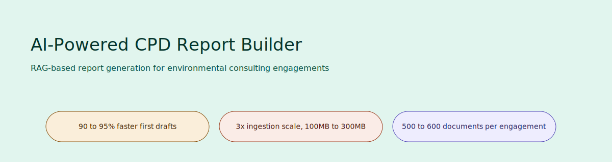
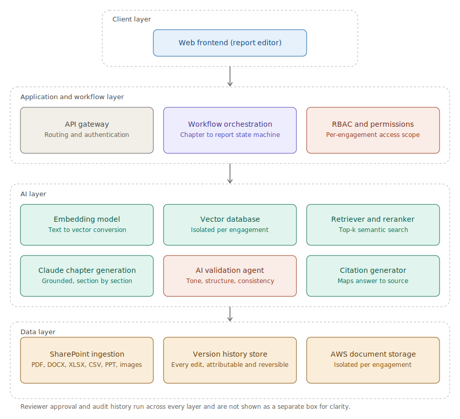

# AI-Powered CPD Report Builder

A greenfield RAG platform that turns Continuing Professional Development report drafting from a multi-month manual process into a days-long, citation-grounded workflow, with an AI validation agent and mandatory human approval before anything reaches a client.

**[Read the full PRD](PRD/Product-Requirements-Document.md)** · **[Read the case study](Case-Study/Executive-Summary.md)**

---

## Product overview

Consultants at an environmental consulting firm spent 2 to 4 months producing a first-draft CPD report by manually reviewing hundreds of project documents. This platform ingests 500 to 600 documents per engagement from SharePoint, generates citation-grounded chapter drafts using Anthropic Claude, and routes every draft through an AI validation agent and a human reviewer before it can be finalized.

## Problem statement

| | |
|---|---|
| **Business problem** | Report production scaled with senior SME availability rather than client demand, capping how many engagements the firm could take on. |
| **User problem** | Consultants could not produce a first draft without months of manual document review, and reviewers could not validate a draft quickly without re-reading the same archive. |
| **Opportunity** | Combine RAG-based drafting with a validation agent and human-in-the-loop approval, speeding up first-draft creation without removing human judgment from the parts that require it. |

## My role

Project Manager / Associate Product Manager, owning delivery end to end across 11 two-week Agile sprints. I ran requirements workshops with 6 client stakeholders, translated requirements into 200+ Jira stories, and led a 15-member cross-functional team through UAT and production release.

## Product impact

| Metric | Result |
|---|---|
| First-draft turnaround | 2 to 4 months → 3 to 5 days (**~90 to 95% faster**) |
| Document ingestion limit | 100MB → 300MB (**3x scalability**) |
| Documents processed per engagement | 500 to 600 |
| Team delivering | 15 cross-functional members, 200+ Jira stories, 11 sprints |
| Stakeholders aligned | 6 client stakeholders |

Full breakdown, including how each number was measured, in [Case-Study/Metrics.md](Case-Study/Metrics.md).

## Architecture

Four layers: a client layer (report editor), an application and workflow layer (API gateway, workflow orchestration, RBAC), an AI layer (embedding, per-engagement vector retrieval, Claude chapter generation, the AI validation agent, citations), and a data layer (SharePoint ingestion, version history, AWS storage).



The step-by-step generation flow, from ingestion through the validation and approval gates that produce a finalized report, is in [Architecture/report-generation-pipeline.svg](Architecture/report-generation-pipeline.svg). The end-to-end user flow is in [Architecture/user-flow.svg](Architecture/user-flow.svg), and the data model is in [Architecture/er-diagram.md](Architecture/er-diagram.md).

## Key features

- **Chapter-wise RAG generation** — grounded strictly in the engagement's own ingested documents, with inline citations.
- **AI validation agent** — flags tone, structure, and consistency issues before a human ever reviews the draft.
- **Human-in-the-loop approval** — no report reaches "final" status without a logged reviewer sign-off.
- **Version history** — every edit is attributable and reversible.
- **SharePoint ingestion at scale** — multi-format support up to 300MB per file, scaled 3x from the original limit.
- **Per-engagement isolation** — each client's documents and retrieval scope stay fully separate from every other engagement.

## Tech stack

| Layer | Technology |
|---|---|
| Cloud | Amazon Web Services (AWS) |
| LLM | Anthropic Claude |
| Retrieval | RAG, per-engagement vector database |
| Document sync | SharePoint integration |
| Delivery | Agile/Scrum, Jira, Confluence |

## Product decisions

Three decisions defined this platform: isolating the vector index per engagement for client confidentiality, making the AI validation agent a required gate rather than an optional check, and generating chapter by chapter instead of in one full-report pass. The reasoning and trade-offs behind each are in [Case-Study/Product-Decisions.md](Case-Study/Product-Decisions.md).

## User journey

Documents sync from SharePoint → consultant triggers chapter generation → AI drafts with citations → the validation agent flags issues → the consultant or SME edits → a reviewer approves → the report exports once every chapter is signed off.

Full walkthrough with the flow diagram in [Research/User-Journey.md](Research/User-Journey.md).

## Repository structure

```
cpd-report-builder/
│
├── README.md                          Portfolio landing page (this file)
│
├── PRD/
│   └── Product-Requirements-Document.md   Full 22-section PRD
│
├── Case-Study/
│   ├── Executive-Summary.md
│   ├── Product-Decisions.md
│   ├── Metrics.md
│   └── Lessons-Learned.md
│
├── Architecture/
│   ├── system-architecture.svg
│   ├── report-generation-pipeline.svg
│   ├── er-diagram.md                  Mermaid ERD (renders natively on GitHub)
│   └── user-flow.svg
│
├── Research/
│   ├── User-Personas.md
│   ├── User-Journey.md
│   └── Pain-Points.md
│
├── Product/
│   ├── Feature-Prioritization.md
│   ├── Roadmap.md
│   ├── API-Design.md
│   └── Success-Metrics.md
│
├── Assets/
│   ├── hero.svg
│   ├── dashboard-mockup.svg
│   ├── editor-mockup.svg
│   ├── workflow.svg
│   └── README.md                      Note on mockups vs. real screenshots
│
└── LICENSE
```

**A note on diagram formats:** diagrams are hand-authored `.svg` rather than `.png`, since GitHub renders them crisply at any size without a rasterization step. The entity relationship diagram is Mermaid inside a `.md` file, since GitHub renders Mermaid natively. The `Assets/` mockups are illustrative concept images rather than real product screenshots, since the underlying platform was built for a confidential consulting client. See [Assets/README.md](Assets/README.md).

## License

[MIT](LICENSE)
