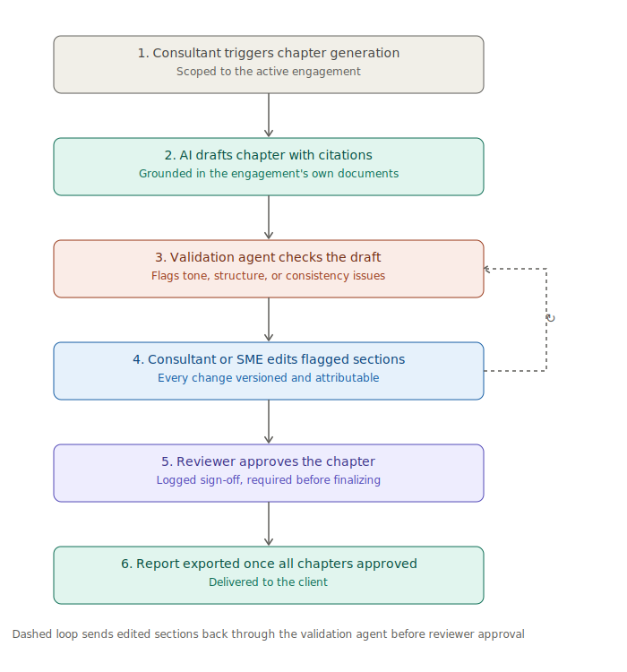

# User journey

## The end-to-end flow

1. **Ingestion.** Project documents sync automatically from SharePoint into the platform.
2. **Chapter generation.** The consultant triggers chapter-wise draft generation, grounded in the ingested archive.
3. **Automated review.** The AI validation agent flags tone, structure, or consistency issues before the SME reviews the draft.
4. **Editing.** The consultant or SME edits directly in the platform, with every change versioned.
5. **Approval.** A named reviewer formally approves the chapter or report before it can be marked final.
6. **Delivery.** The finalized report is exported for the client.

## Why the validation step comes before human review
Putting the AI validation agent ahead of the SME review, rather than after, meant the human reviewer only ever saw a chapter that had already cleared a mechanical consistency bar. That ordering is what actually saved reviewer time, not just the existence of the validation agent itself.

## Where the journey diverges by persona
- **Consultants** spend most of their time in steps 2 and 4, generating and refining drafts.
- **SMEs** engage primarily at steps 3 and 5, validating flagged issues and giving final approval.
- **Product leadership** interacts with none of the drafting steps directly, but watches turnaround time and flag rates across engagements.

See the [Product Flow](../PRD/Product-Requirements-Document.md#11-product-flow) in the PRD for the underlying decision logic behind each step.
